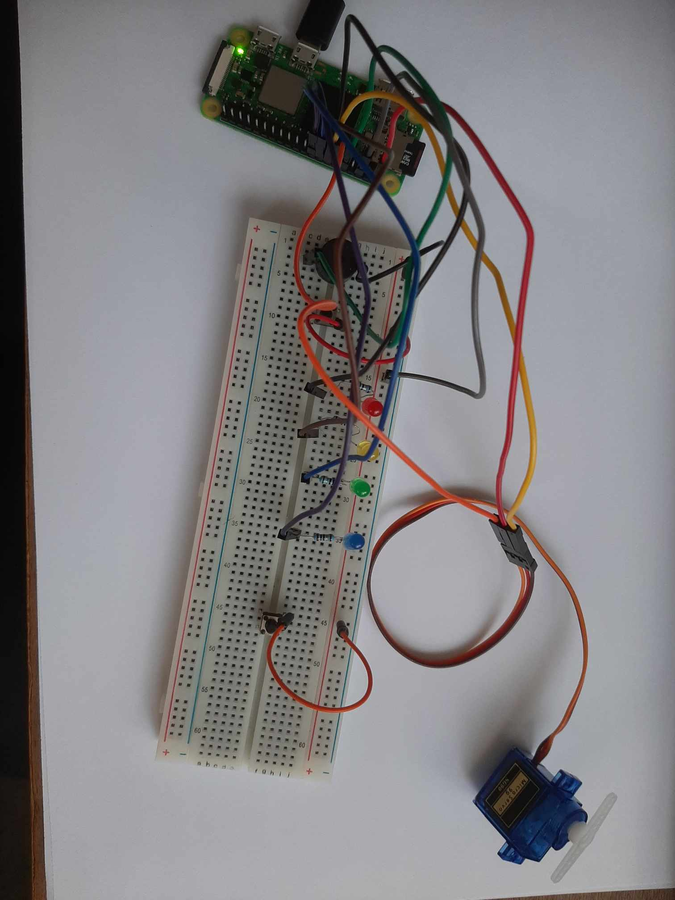
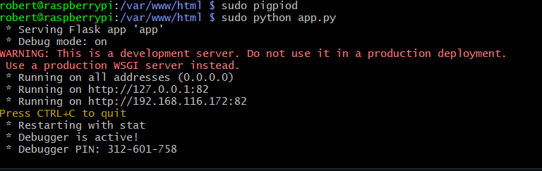
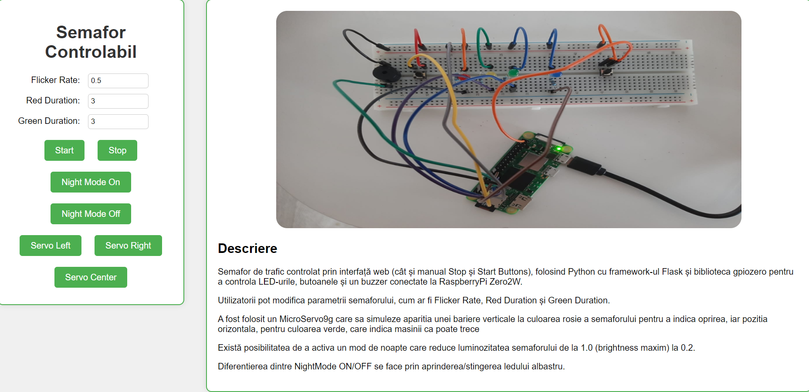
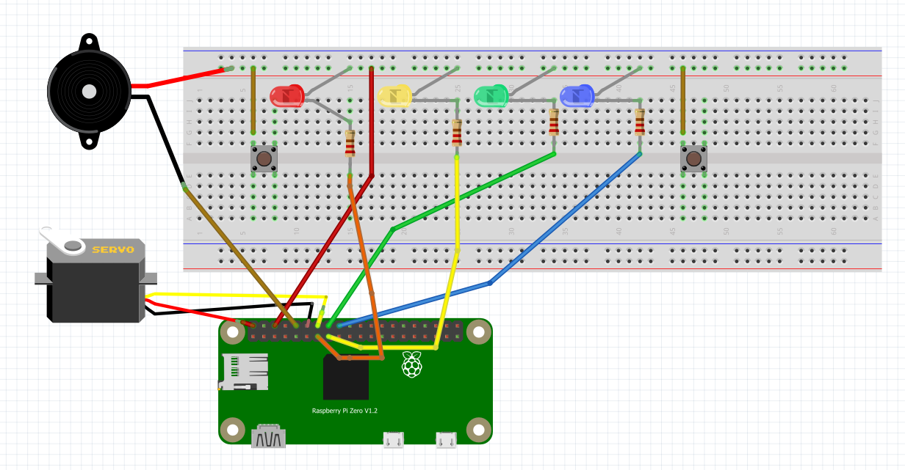
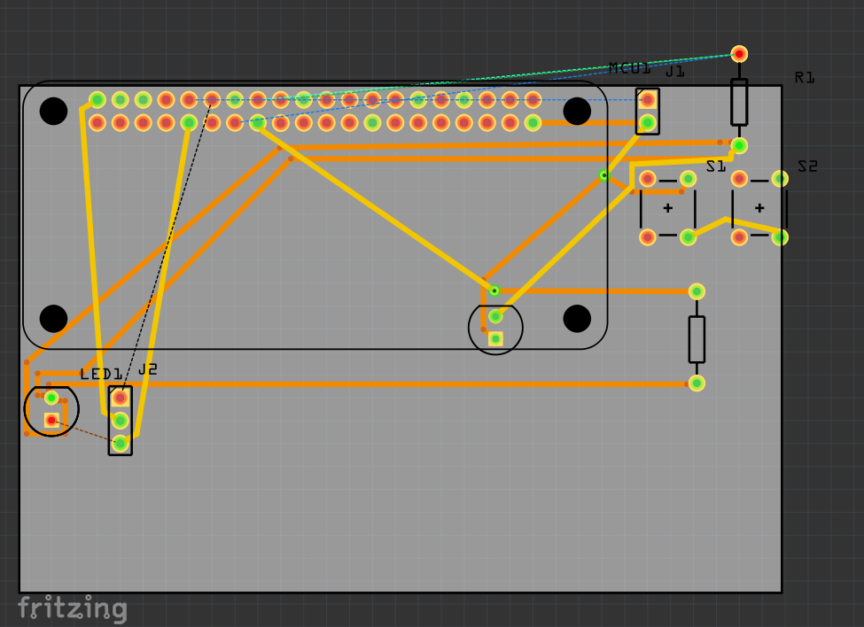
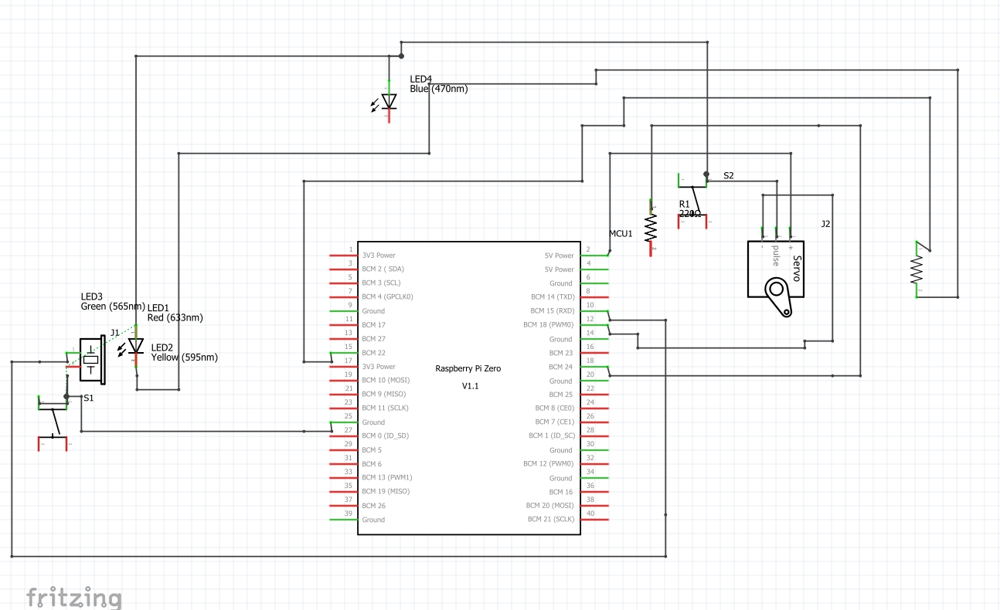

### SmartTrafficLight-RPi2W

## Table of Contents
1. [Description](#description)
2. [Hardware Components](#components)
3. [Installation](#istallation-steps)
4. [Schematics](#schematics)
5. [Source Code](#source-code)
6. [Links](#links)
7. [References](#references)

---
## Project Description
- The project involves creating a traffic light controlled through a web interface and manually, using Python with the Flask framework and the gpiozero library to control LEDs, buttons, and a buzzer connected to a Raspberry Pi Zero 2W.

- Users can modify traffic light parameters such as Flicker Rate, Red Duration, and Green Duration directly from the web interface.

- I integrated a MicroServo9g to simulate a vertical barrier at the red light, indicating stop, and a horizontal position at the green light, indicating that cars can pass.

- The project also includes a night mode, which reduces the brightness of the traffic light from 1.0 (maximum brightness) to 0.2. The differentiation between NightMode ON and OFF is indicated by turning the blue LED on and off.



For the project, I used the following hardware and software components:

### Hardware Components:
- Raspberry Pi Zero 2W
- Breadboard MB-102
- USB - MicroUSB cable
- SD Card (for RaspbianOS installation)
- Red LED, Yellow LED, Green LED, Blue LED
- MicroServo9g SG90
- Jumper wires
- 220 ohm resistors, 1K ohm resistors

### Installation Steps
1. Installed Raspberry Pi OS using Raspberry Pi Imager.

2. Connected to the Raspberry Pi using SSH:
   ```bash
   ssh robert@raspberrypi.local
   ```
   - The default username is 'pi' and the password is 'raspberry'. 

3. Install the package for the Apache2 web utility:
   ```bash
   sudo apt update
   sudo apt install python3-pip
   sudo apt install apache2
   ```

4. Cloned or extracted the downloaded project on the Raspberry Pi and navigated to the project directory:
   ```bash
   # Apache2 dependencies location
   cd /var/www/html
   ```
   To transfer files from local to Raspberry Pi,I used scp:
   ```
   # Copy from Raspberry to Windows
   scp robert@raspberrypi.local:/var/www/html/app.py d:\   
   ```
5. To find the address where the server is running:
   ```bash
   hostname -I
   ```
6. Running the project with Apache2 and accessing the web interface:
   ```bash
   # Because I used the pigpiod library for the web interface
   sudo pigpiod
   sudo python app.py
   ```
7. Open a browser and navigate to the specified address http://[raspberry-pi-ip]:5000/ to access the web interface:

   

8. To run the project:
```bash
   git clone https://github.com/Drexel7/SmartTrafficLight-RPi2W.git
   ```
- Web interface created with Apache2


---

---
## Schematics

Electronic schematic - breadboard:




Electronic schematic PCB:



Electronic schematic:




## Source code

- The project code is written in Python using the Flask, gpiozero, and RPi.GPIO libraries. The script manages the automatic and manual operation of the traffic light, includes logic for controlling the LEDs, buzzer, and servo, and allows users to adjust the traffic light parameters through a web interface.

```python
from flask import Flask, render_template, redirect, request, url_for
from gpiozero import LED, PWMLED, Button, Buzzer, Device
from gpiozero.pins.pigpio import PiGPIOFactory
import atexit
import threading
import time
import RPi.GPIO as GPIO

#Flask initialization
app = Flask(__name__)

# Configurare GPIO pentru LED-uri și buzzer
Device.pin_factory = PiGPIOFactory()
red_led = PWMLED(27)
yellow_led = PWMLED(22)
green_led = PWMLED(23)
blue_led = LED(24)
buzzer = Buzzer(15)

``` 
- Servo Setup

```python
GPIO.setwarnings(False)
GPIO.setmode(GPIO.BOARD)
GPIO.setup(12, GPIO.OUT) 
servo = GPIO.PWM(12, 50)
servo.start(0)


# Configurare Butoane

start_button = Button(4)
stop_button = Button(21)

# Variabile de control
running = False
night_mode = False
flicker_rate = 0.5
red_duration = 3
green_duration = 3

```

- Cleanup function
```python
def cleanup():
    red_led.close()
    yellow_led.close()
    green_led.close()
    blue_led.close()
    buzzer.close()
    servo.stop()
    GPIO.cleanup()

atexit.register(cleanup)

# Funcție pentru intermitența LED-urilor
def flicker_led(led, rate, duration, brightness=1.0, activate_buzzer=False):
    start_time = time.time()
    while time.time() - start_time < duration and running:
        led.value = brightness
        if activate_buzzer:
            buzzer.on()
        time.sleep(rate)
        led.off()
        if activate_buzzer:
            buzzer.off()
        time.sleep(rate)


# Funcție pentru mișcarea servo-ului
def move_servo(position):
    print(f"Mută servo la poziția {position}")
    servo.ChangeDutyCycle(position)
    time.sleep(0.5)
    servo.ChangeDutyCycle(0)
```
- Traffic light control sequence
```python
def traffic_light_sequence():
    global running, flicker_rate, red_duration, green_duration, night_mode
    while True:
        if running:
            current_red_duration = red_duration / 2 if night_mode else red_duration
            current_green_duration = green_duration / 2 if night_mode else green_duration

            print(f"Night Mode: {night_mode}, Red Duration: {current_red_duration}, Green Duration: {current_green_duration}")

            brightness = 0.2 if night_mode else 1.0

            # Mută servo în poziția blocată
            move_servo(5)  
            flicker_led(red_led, flicker_rate, current_red_duration, brightness=brightness)
            yellow_led.value = brightness
            time.sleep(3)
            yellow_led.off()

            # Mută servo în poziția deschisă
            move_servo(10)
            flicker_led(green_led, flicker_rate, current_green_duration, brightness=brightness, activate_buzzer=True)

        time.sleep(0.1)

```

- Features for traffic control and night mode
```python
def start_traffic():
    global running
    running = True

def stop_traffic():
    global running
    running = False

def enable_night_mode():
    global night_mode
    night_mode = True
    print("Night mode enabled")

def disable_night_mode():
    global night_mode
    night_mode = False
    print("Night mode disabled")
```
- Configured events for physical buttons
```python
start_button.when_pressed = start_traffic
stop_button.when_pressed = stop_traffic
```

- Routes for web interface control
```python
@app.route('/start')
def start():
    start_traffic()
    return redirect(url_for('index'))

@app.route('/stop')
def stop():
    stop_traffic()
    return redirect(url_for('index'))

@app.route("/", methods=["GET", "POST"])
def index():
    global flicker_rate, red_duration, green_duration
    if request.method == "POST":
        print("Received POST request")
        if "start_button" in request.form:
            flicker_rate = float(request.form.get("flicker_rate", 0.5))
            red_duration = int(request.form.get("red_duration", 3))
            green_duration = int(request.form.get("green_duration", 3))
            print(f"Updated settings: flicker_rate={flicker_rate}, red_duration={red_duration}, green_duration={green_duration}")
            start_traffic()
        elif "stop_button" in request.form:
            stop_traffic()
        elif "night_mode_on" in request.form:
            enable_night_mode()
        elif "night_mode_off" in request.form:
            disable_night_mode()
        elif "servo_left_button" in request.form:
            move_servo(5)
        elif "servo_right_button" in request.form:
            move_servo(10)
        elif "servo_center_button" in request.form:
            move_servo(7.5)
    return render_template("index.html", flicker_rate=flicker_rate, red_duration=red_duration, green_duration=green_duration)


if __name__ == '__main__':
    try:
        app.run(host='0.0.0.0', port=82, debug=True)
    finally:
        cleanup()
```

## Links

- Project repository: [Git Project](https://github.tuiasi.ro/SM24/1308A_3)
- GitHub Documentation: [Documentation](https://github.tuiasi.ro/SM24/1308A_3/blob/main/Documentatie.md)
- Project on hackster.io: [hackster.io](https://www.hackster.io/robertmafteigutui/traffic-light-4942ca)

## References
- [Gpiozero library documentation](https://gpiozero.readthedocs.io/en/latest/)
- [Optimus Digital - electronic components supplier](https://www.optimusdigital.ro/ro/)
- [Buzzer ](https://components101.com/misc/buzzer-pinout-working-datasheet)
- [Servo Motor SG90](http://www.ee.ic.ac.uk/pcheung/teaching/DE1_EE/stores/sg90_datasheet.pdf)

